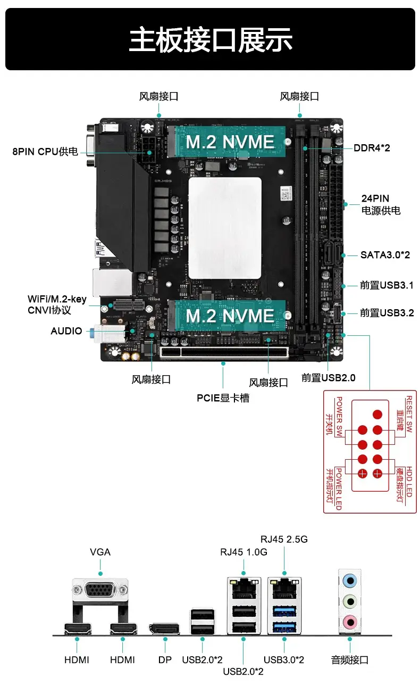

## 天邦 13900H ES ITX 黑苹果 OpenCore EFI



## 评测文章 [《圾皇狂喜 新手地狱？i9 13900H 魔改板U套装评测》](https://www.igeekbb.com/2024/01/02/13900h/)

<details>
  <summary>
    <h3 style="background-color: blue; color: white; padding: 5px; font-weight: bold;">
      20240112 更新 V1.1
    </h3>
  </summary>
 - 加入 CpuTopologyRebuild.kext 优化13代CPU多线程
优化前跑分&优化后跑分（多核增加近千分）
  
  

 正确识别大小核和超线程

</details>

### macOS

- Ventura
- Monterey
- Sonoma


### 硬件

- BIOS版本: Leo Bios
- 处理器: 英特尔13代 i9-13900H ES
- 内存: 金百达 CJR 32GB(16GB*2) DDR4 3600 Mhz
- 显卡: AMD RX580 8G
- 声卡: 瑞昱 ALC897
- 有线网卡: 瑞昱 RTL8125 Gaming 2.5GbE
- 有线网卡: 瑞昱 RTL8111
- 无线网卡: BCM94360CS2
- 处理器散热: 利民 AXP90-X53 WHITE 白色
- 电源: 鑫谷（Segotep）750W 全模850电源
- 机箱: 超导合体 ITX 机箱


### BIOS设置

```
Leo BIOS固件:
禁用 CSM
禁用 Fast Boot
禁用 Secure Boot
```
### 完美情况
- [x] 声卡正常
- [x] 双网卡正常
- [x] 显卡正常
- [x] 睡眠正常
- [x] USB定制
- [x] WIFI&蓝牙正常 （需要打[补丁](https://www.igeekbb.com/2023/09/27/Hackintoswifi/)）
- [ ] 温度

### 使用kext

### USB定制


### 注意事项

 - 安装成功后必须使用 [OpenCore Configurator](https://mackie100projects.altervista.org/opencore-configurator/) 或者 [OCAuxiliaryTools](https://github.com/ic005k/OCAuxiliaryTools) 生成你自己的 SMBIOS
 - 使用博通网卡安装Sonoma的用户请自行修改EFI、添加博通无线驱动并使用OCLP补丁
 - 使用英特尔无线网卡的用户请自行根据MacOS版本添加[英特尔无线](https://hackintosh.club/d/10000015)和[蓝牙驱动](https://hackintosh.club/d/10000017)


### 常用工具

- [Hackintool](https://github.com/headkaze/Hackintool) 
- [OCAuxiliaryTools](https://github.com/ic005k/OCAuxiliaryTools) AKA `OCAT`.
- [OpenCore Configurator](https://mackie100projects.altervista.org/opencore-configurator/) AKA `OCC`.
- [gibMacOS](https://github.com/corpnewt/gibMacOS) Build your own MacOS image.
- [ProperTree](https://github.com/corpnewt/ProperTree) Plist editor.
- [OpenCore 0.9.7](https://github.com/acidanthera/OpenCorePkg)

